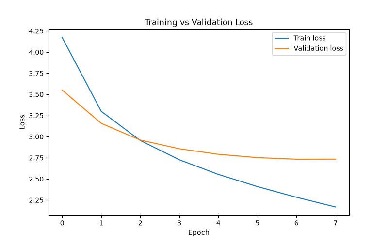

# Image Captioning System (CNN Encoder + LSTM Decoder)

- **Author:** Muhammad Anayatullah
- **Program:** Nextbridge Summer Internship 2026 — AI / Machine Learning Track
- **Task:** Task 4 — Image Captioning (CNN + NLP)
- **Dataset:** Flickr8k (8,091 images, 5 captions each)

---

## Overview

This project implements an end-to-end image captioning pipeline. A pretrained, frozen
ResNet-50 CNN extracts a fixed-length feature vector from an input image, and an LSTM decoder
generates a natural-language caption from that vector, one word at a time. The trained model is
served through a FastAPI REST endpoint and packaged as a Docker image for portable deployment.

Example:

| Input | Generated Caption |
|---|---|
| Photo of a child climbing a tree | "a little girl in a pink dress is climbing a tree" |

## Architecture

```
Image (224x224x3)
      |
      v
ResNet-50 (frozen, ImageNet-pretrained)
      |
      v
2048-dim feature vector
      |
      v
LSTM Decoder (embedding -> LSTM -> vocabulary projection)
      |
      v
Generated caption (word by word)
      |
      v
FastAPI /caption endpoint  -->  Docker container
```

The encoder is used purely as a fixed feature extractor: its final classification layer is
removed and its weights are never updated during training. The decoder's LSTM is seeded with
the image feature (projected into its initial hidden and cell state) and generates captions
autoregressively — greedy decoding picks the single most probable next word at each step; beam
search (k=3) tracks multiple candidate sequences at once and returns the best-scoring complete
sequence.

## Project Structure

```
image-captioning/
├── settings.py               Central configuration (paths, hyperparameters)
├── src/
│   ├── preprocessing.py      Load captions.txt; split train/val/test by image
│   ├── vocabulary.py         Tokenization; word-to-id mapping; save/load
│   ├── encoder.py             Frozen ResNet-50 CNN encoder
│   ├── feature_extraction.py Cache CNN features to disk
│   ├── dataset.py             PyTorch Dataset and batch collation
│   ├── decoder.py             LSTM decoder: training, greedy decoding, beam search
│   ├── train.py                Training loop, checkpointing, loss curves
│   ├── evaluate.py             BLEU scoring; greedy vs. beam search comparison
│   └── utils.py                 Device selection, image preprocessing, logging
├── app/
│   ├── inference.py           Loads the trained model once; runs inference
│   └── main.py                  FastAPI application and /caption endpoint
├── models/                     Trained weights, vocabulary, config (not committed)
├── reports/                    Loss curve and evaluation report
├── requirements.txt
├── Dockerfile
└── README.md
```

## Setup

```powershell
python -m venv .venv
.venv\Scripts\Activate.ps1
pip install -r requirements.txt
```

Place the Flickr8k dataset as:

```
data/
├── Images/          8,091 JPEG images
└── captions.txt     image_filename, caption
```

Images are split 80% / 10% / 10% into train/validation/test at the image level (all five
captions of a given image remain in the same split), using a fixed random seed for
reproducibility.

## Training

```powershell
python -m src.feature_extraction
python -m src.train
python -m src.evaluate
```

Only the checkpoint with the lowest validation loss is kept. In this training run, validation
loss stopped improving after epoch 7 and increased slightly at epoch 8, indicating the model
had begun to overfit; the epoch 7 weights were retained.

## Results

**BLEU scores, test set (810 images):**

| Decoding strategy | BLEU-1 | BLEU-2 | BLEU-3 | BLEU-4 |
|---|---|---|---|---|
| Greedy | 0.601 | 0.422 | 0.283 | 0.189 |
| Beam search (k=3) | see `reports/evaluation_report.json` | | | |

**Example generated captions:**

| Image | Reference caption | Generated caption |
|---|---|---|
| 3449170348_34dac4a380.jpg | A girl dances on a sidewalk. | a young girl wearing a pink shirt and pink pants is running through a grassy area |
| 3626964430_cb5c7e5acc.jpg | People playing cricket in the park. | two men are playing soccer in a field |
| 1000268201_693b08cb0e.jpg | (girl climbing a tree) | a little girl in a pink dress is climbing a tree |
| 3153067758_53f003b1df.jpg | A person holding a paper bag above a baggage cart. | a man is sitting on a bed with a `<unk>` (failure case) |



## API Usage

Start the server:

```powershell
uvicorn app.main:app --reload --port 8000
```

Interactive documentation is available at `http://127.0.0.1:8000/docs`.

| Method | Endpoint | Description |
|---|---|---|
| GET | `/` | Health check |
| POST | `/caption` | Upload an image; returns a generated caption |

Example request:

```powershell
curl.exe -X POST "http://127.0.0.1:8000/caption" -F "file=@data/Images/example.jpg"
```

Example response:

```json
{"caption": "a little girl in a pink dress is climbing a tree"}
```

## Docker

```powershell
docker build -t image-captioning-api .
docker run -d -p 8000:8000 --name captioning-container image-captioning-api
curl.exe -X POST "http://127.0.0.1:8000/caption" -F "file=@data/Images/example.jpg"
```

Note: the Dockerfile's `CMD` uses `--host 0.0.0.0`, which is required — uvicorn's default host
(`127.0.0.1`) only accepts connections originating from inside the container itself.

## Design Decisions

**Frozen ResNet-50 encoder.** Flickr8k contains only 8,091 images, too few to fine-tune a
25-million-parameter CNN without overfitting. Freezing the encoder also allows its output to be
cached once per image instead of recomputed on every training epoch, substantially reducing
training time.

**LSTM decoder with an init-hidden-state design.** The image feature is projected into the
LSTM's initial hidden and cell state rather than injected as a pseudo input token, keeping
padding and masking straightforward. Training uses teacher forcing (the decoder is fed the
actual previous word at each step); inference uses either greedy or beam search decoding, since
no ground truth is available to feed back in during generation.

**Best-checkpoint retention.** Only the checkpoint with the lowest validation loss is saved,
rather than the final epoch's weights, since the decoder can overfit past its best point on a
dataset of this size.

**Shared preprocessing pipeline.** The same image transform (resize, tensor conversion,
ImageNet normalization) is used both when caching features during training and inside the
FastAPI service at inference time, preventing a training/serving mismatch.

## Limitations and Future Work

- Trained for 8 epochs on CPU; additional epochs or GPU training would likely improve BLEU
  scores further.
- No attention mechanism: the decoder conditions on a single pooled image vector rather than
  spatial feature maps, limiting its ability to focus on specific image regions.
- Vocabulary is restricted to words occurring at least 5 times in the training captions; rarer
  or unseen words are mapped to an unknown-word token.
- Given additional time, adding a visual attention mechanism would likely be the single
  highest-impact next improvement.
